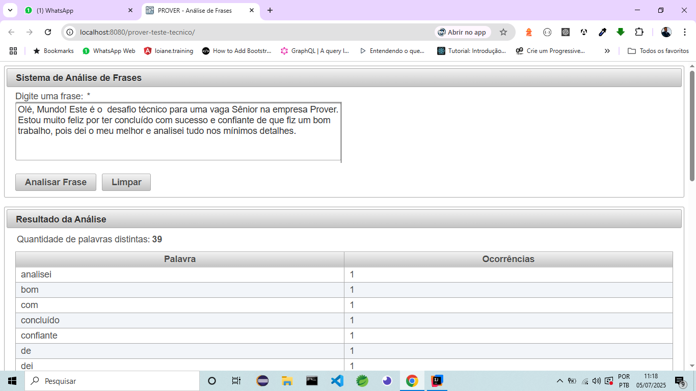

# Teste Técnico Prover – Analisador de Frases

Este projeto foi desenvolvido como parte do processo seletivo para a vaga de **Desenvolvedor Sênior** na Prover Soluções em TI & Software House.  
O sistema é uma aplicação web que recebe uma frase do usuário, realiza uma análise para contar a quantidade de palavras distintas e a frequência de cada uma, e exibe os resultados.

O projeto foi construído com foco em:
- Qualidade do código
- Boas práticas de desenvolvimento
- Testabilidade
- Arquitetura limpa
- Código Limpo
- Padrões de Projeto
- Princípios SOLID

---

## ✨ Funcionalidades

- **Análise de Texto**: entrada de uma frase para análise.
- **Contagem de Palavras Distintas**: número total de palavras únicas na frase.
- **Frequência de Palavras**: tabela com cada palavra encontrada e sua contagem.
- **Processamento Sincronizado**: engine backend processa apenas uma requisição por vez, garantindo consistência em ambiente concorrente.
- **Interface Reativa**: AJAX atualiza resultados sem reload da página, com botões de *Analisar* e *Limpar*.

---

## 🛠️ Tecnologias Utilizadas

| Camada                   | Tecnologia                                 |
|--------------------------|--------------------------------------------|
| Linguagem                | Java 8                                     |
| Framework Web            | JSF 2.2                                    |
| Biblioteca de Componentes| PrimeFaces 6.2                             |
| Injeção de Dependência   | CDI 1.2                                    |
| Servidor de Aplicação    | WildFly 10.1.0.Final                       |
| Build e Dependências     | Apache Maven                              |
| Testes                   | JUnit 5                                    |
| Controle de Versão       | Git & GitHub                               |

---

## 📂 Estrutura de Pacotes

```text
br.com.prover.teste/
├── controller/     (Backing Beans do JSF – Camada de Apresentação)
├── model/          (DTOs – Camada de Modelo)
└── service/        (Lógica de Negócio – Camada de Serviço e Interfaces)
```
## 🚀 Como Executar o Projeto

1. Pré-requisitos

- JDK 8

- Apache Maven 3.6+

- Git

- WildFly 10.1.0.Final

2. Clonar o Repositório
```text
git clone https://github.com/seu-usuario/seu-repositorio.git
cd seu-repositorio
```

3. Construir o Projeto (Build)

```text
mvn clean install
```

**O artefato prover-teste-tecnico.war será gerado em target/** .

4. Deploy no WildFly

- Inicie o WildFly.

- Copie target/prover-teste-tecnico.war para standalone/deployments/.

- O WildFly fará hot deploy automaticamente.

5. Acessar a Aplicação
   
- Abra no navegador e cole o seguinte endereço:
```text
http://localhost:8080/prover-teste-tecnico/
```

## 🧪 Testes

O projeto inclui testes unitários na camada de serviço:

```test
mvn test
```
## 🖼️ Screenshot



## 👨‍💻 Autor
# Amilton Carlos da Paz Junior

https://www.linkedin.com/in/amiltonpaz/


## ✅ Considerações Finais

Este template facilita a leitura e manutenção do relatório, com:

- Seções bem definidas

- Tabelas e caixas de código corretas

- Estrutura clara e organizada